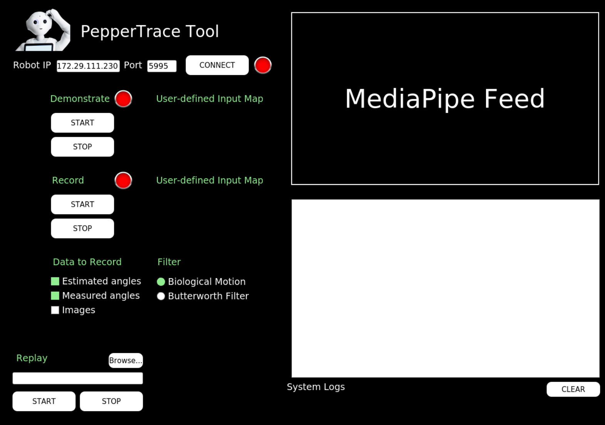

# PepperTrace: Programming By Demonstration Tool

This tool is implemented in the context of the [CSSR4Africa project](https://cssr4africa.github.io/) project for programming the Pepper robot by demonstration. Users interact with the system by performing gestures in front of an RGBD camera. Human joint positions are estimated using a skeletal model from MediaPipe and retargeted to Pepper’s joint angles.
Various filters can be applied to increase the smoothness of imitation of the demonstrated movements. The tool can be used for data collection to train models.

# Getting Started with the Tool

## Installation

The tool is available in a Docker container to enable users of other
operating systems and setups to use Ubuntu 20 with ROS Noetic. This
tutorial is targeted for Windows users.

**Step 1**: Install Docker from the [official
    website](https://docs.docker.com/desktop/setup/install/windows-install/).
    A video walkthrough can be found
    [here](https://www.youtube.com/watch?v=WDEdRmTCSs8). Open a terminal
    and verify the installation with

    docker --version

**Step 2**: Pull the PepperTrace Docker image. This takes a while depending on
    your internet connection. The image is still quite heavy and will be
    reduced in future versions of the software. After installing, verify
    that the image has been pulled correctly.

   
    docker pull danielcortezbarros/peppertrace
    docker images

**Step 3**: We need an X-Server on Windows to be able to use the GUI inside the
    Docker container. Please install it
    [here](https://sourceforge.net/projects/vcxsrv/).

**Step 4**: We also need a tool to give Docker access to the camera via USB.
    Please install this
    [here](https://github.com/dorssel/usbipd-win/releases/tag/v4.3.0).

## Execution

With one exception that is specified below, the following steps are
necessary each time to run the PepperTrace Programming by Demonstration
Tool. 

**Step 1**: Start the X-server by launching the app and clicking "Multiple
    windows\", "Next\", "Start no client\", "Next\", "Disable access
    control\", "Finish\". Leave previously checked fields unchanged.
    This should start the server. You can check by looking for an icon
    with a black X in the up-arrow in the windows task bar.

**Step 2**: Make sure that the Intel RealSense camera is plugged into USB. Run a Windows PowerShell as an administrator (click Windows icon and search for it) and run:

    usbipd list

Find the Intel RealSense and note the bus id for the following
    commands e.g. 4-4:

    usbipd bind --busid 4-4
    usbipd attach --wsl --busid 4-4

**Step 3**:  In the commands below, replace \$DISPLAY with your PC's IP address.
    The following command is only used the first time executing the
    tool. If you have an Nvidia GPU on your machine run:

    docker run --name peppertrace-container --privileged --device=/dev/bus/usb/ --runtime=nvidia --gpus all -e DISPLAY=$DISPLAY -v /tmp/.X11-unix:/tmp/.X11-unix -it danielcortezbarros/peppertrace:latest

Otherwise run:

    docker run --name peppertrace-container --privileged --device=/dev/bus/usb/ -e DISPLAY=$DISPLAY -v /tmp/.X11-unix:/tmp/.X11-unix -it  danielcortezbarros/peppertrace:latest

From the second time onwards, simply run the existing container:

    docker start peppertrace-container

**Step 4**: Pull the latest changes from the Github repository:

    cd /root/workspace/pepper_rob_ws/src/programming_by_demonstration 
    git pull

**Step 5**: When running for the first time or with a new camera, run this
    script to configure the camera parameters, otherwise skip this step.

    python3 /root/workspace/pepper_rob_ws/src/programming_by_demonstration skeletal_model/config/set_camera_intrinsics.py

**Step 6**: Start the tool by running the following command. This should launch
    the GUI.

    roslaunch programming_by_demonstration programming_by_demonstration.launch

## (Optional) Configuration

The `programming_by_demonstration` software package consists of three
components, `skeletal_model`, `demonstration_recorder` and
`demonstration_gui`, each with configuration files in their `/config`
folders.

**Configure skeletal model**: Besides the camera intrinsics there are other configuration options
    in the config file of the `skeletal_model` component, however it is
    not necessary to change them.

**Configure demonstration recorder**: You can check and configure where data recordings are stored in the
    configuration file of the `demonstration_recorder` component through
    the `data_dir` (base directory) and `demo_name` (demo directory)
    parameters. It is not necessary to change the parameters.

**Configure demonstration gui**: You can configure some parameters for the GUI in the configuration
    file of the `demonstration_gui` component. This is not necessary.

# Main Features

The PepperTrace GUI contains the following features for connecting to
the robot, performing, recording and replaying demonstrations while
logging imporant information for the user. 

**Connect**: Enter the IP address and port of the Pepper robot and click the
    CONNECT button. This should connect the GUI to the Pepper robot and
    enable its controllers. Pressing the button again will stop the
    controllers and disconnect the robot.

**Demonstrate**: Press START under Demonstrate to enable demonstration. If a human is
    present in front of the camera, the software will capture its upper
    body movements and retarget them to Pepper in real time. Pressing
    STOP will stop this process.

**Record**: Press START under Record to record a demonstration. Check the boxes
    corresponding to the data that should be recorded during the
    demonstration. Demonstrate needs to be enabled for this to work.
    This will save the specified data to .bag files.

**Replay**:Enter the path to a .bag file for replaying data and reproducing
    movement demonstrated in a previous recording session.
    Alternatively, click the Browse button and select the .bag file from
    the file dialog that appears. Click START to replay the bag file.
    The process will stop automatically when there is no more data to
    publish, unless you press STOP to before that.

**Logging**: System logs (Infos, Warnings, Errors) are displayed to the System
    Logs box in the GUI. The skeletal model feed is displayed in the GUI
    when Demonstrate is on and the upper body joints of a human are
    detected in front of the camera.

# Reporting Issues 

To report an issue or request a feature, please follow these steps:

**Step 1**: Go to "Issues\".

**Step 2**: Check if your issue exists, otherwise open a new issue by clicking
    "New issue\".

**Step 3**: Add a label to the issue:
- bug: For reporting something that is not working.
- new_feature: For requesting a new feature.
- docs: For requesting further documentation.
- question: For general remarks.

**Step 4**: Please give a descriptive title and report the issue as clearly and with as much detail as possible, including code sections if applicable.

**Step 5**: Follow and monitor the issue, as we may have follow-ups.

